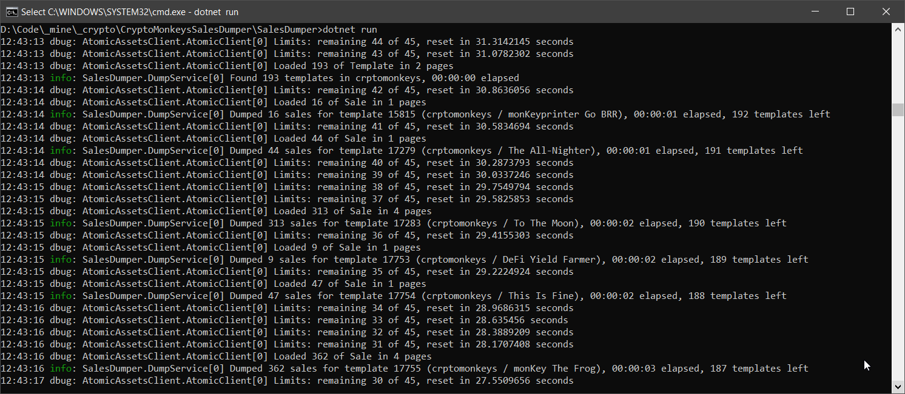

# AtomicHub Sales dumper

Dumps all actual and historical sales from AtomicHub into CSV file.

⚠ AtomicHub throttles API requests to 90 per minute (per IP). This tool "sleeps" automatically when needed, but your other AtomicHub activites (other tools, regular browsing) may be affected.

## Requirements

* .NET SDK (v6.0 and later) from https://dotnet.microsoft.com/en-us/download

## Configuration

Not required.

## Running

1. Clone this repo
2. Open command prompt (`cmd.exe`) or shell
3. Navigate to `SalesDumper` subfolder
4. Type `dotnet run` and press `Enter`

Text like this means everything works.

At time of writing this tool (September 2002, ~190 templates) full download takes about 20 minutes.

Data are written into `crptomonkeys-sales.csv` in `SalesDumper` folder.